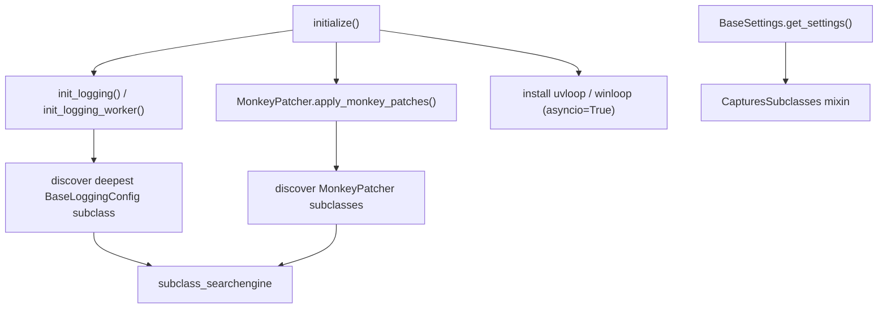

# aeth-ext

> This markdown file and subclass_searchengine.py was AI generated by Claude. All other code was written by me.
> Sweet Fire Tobacco shared library — a batteries-included foundation for building
> Python services, batch jobs, and CLI tools.

`aeth-ext` bundles the cross-cutting infrastructure that the Sweet Fire Tobacco
projects rely on: a one-call application bootstrap, an opinionated logging stack
built on [Rich](https://github.com/Textualize/rich), pydantic-based settings,
FTP/SFTP transfer adapters, a static (import-free) subclass discovery engine, a
monkey-patching framework, alert emails, and assorted utilities.

- **Python:** `>=3.14`
- **Package name (PyPI):** `aeth-ext`
- **Import name:** `aeth_ext`
- **Author:** Jacob Ogden

---

## Table of contents

- [aeth-ext](#aeth-ext)
  - [Table of contents](#table-of-contents)
  - [Installation](#installation)
  - [Quick start](#quick-start)
  - [Architecture overview](#architecture-overview)
  - [Modules](#modules)
    - [`aeth_ext` — application bootstrap](#aeth_ext--application-bootstrap)
    - [`settings` — configuration](#settings--configuration)
      - [Helpers](#helpers)
    - [`logging` — logging stack](#logging--logging-stack)
      - [Constant auto-configuration](#constant-auto-configuration)
      - [Subclassing](#subclassing)
      - [Public API](#public-api)
    - [`errors` — fatal-exception handling \& alerts](#errors--fatal-exception-handling--alerts)
    - [`ftp` — FTP / SFTP adapters](#ftp--ftp--sftp-adapters)
      - [Shared interface](#shared-interface)
      - [Errors](#errors)
    - [`monkey_patcher` — patch framework](#monkey_patcher--patch-framework)
    - [`subclass_searchengine` — static class discovery](#subclass_searchengine--static-class-discovery)
    - [`const_parsing` — constant extraction](#const_parsing--constant-extraction)
    - [`utils` — email \& datetime helpers](#utils--email--datetime-helpers)
    - [`types` — shared types \& mixins](#types--shared-types--mixins)
    - [`rich` — enhanced progress bars](#rich--enhanced-progress-bars)
  - [Configuration reference](#configuration-reference)
  - [Development](#development)
  - [Releasing](#releasing)

---

## Installation

The library is published to the internal SFTPyPI index.

```bash
# base install
uv add aeth-ext

# with the high-performance async event loop (uvloop on Linux, winloop on Windows)
uv add "aeth-ext[async]"

# with SFTP support (paramiko)
uv add "aeth-ext[sftp]"

# everything
uv add "aeth-ext[async,sftp]"
```

| Extra   | Pulls in                               | Use when                             |
| ------- | -------------------------------------- | ------------------------------------ |
| `async` | `uvloop` (Linux) / `winloop` (Windows) | You call `initialize(asyncio=True)`  |
| `sftp`  | `paramiko`                             | You use `AdaptedSFTP`                |

Core runtime dependencies: `aiologic`, `pydantic-settings`, `python-dateutil`,
`rich`, `tzdata`.

---

## Quick start

```python
from aeth_ext import initialize

# Bootstraps logging, applies registered monkey patches, and (optionally)
# installs a high-performance asyncio event loop.
initialize(asyncio=True)
```

A more complete service entry point:

```python
# main.py
from aeth_ext import initialize
from aeth_ext.settings import BaseSettings


# 1. Define your settings by subclassing BaseSettings.
class Settings(BaseSettings):
    api_token: str  # read from env var API_TOKEN (or .env in debug)


def main() -> None:
    initialize(asyncio=False)          # logging + monkey patches
    settings = Settings.get_settings() # resolved singleton
    ...


if __name__ == "__main__":
    main()
```

---

## Architecture overview

A central theme of the library is **static, import-free discovery**: rather than
forcing you to register components in a central place, `aeth_ext` scans your
source tree, finds the most-derived subclass of a given base, and wires it up
automatically. This powers settings (`BaseSettings`), logging
(`BaseLoggingConfig`), and patches (`MonkeyPatcher`).



---

## Modules

### `aeth_ext` — application bootstrap

The package root exposes a single orchestration function.

```python
def initialize(
    *queues: QueueCatchall,
    asyncio: bool = False,
    worker: bool = False,
    run_monkey_patches: bool = True,
    return_wrapped: bool = False,
) -> None | Callable[[], None]: ...
```

| Parameter            | Default | Description                                                                                   |
| -------------------- | ------- | --------------------------------------------------------------------------------------------- |
| `*queues`            | none    | Logging queues (`QueueCatchall`) to attach for multi-process / multi-thread log fan-in.       |
| `asyncio`            | `False` | Install `uvloop` (POSIX) or `winloop` (Windows) as the active event loop. Requires `[async]`. |
| `worker`             | `False` | Use worker-process logging config (`init_logging_worker`) instead of main-process config.     |
| `run_monkey_patches` | `True`  | Discover and apply every `MonkeyPatcher` subclass before the app starts.                      |
| `return_wrapped`     | `False` | Return the initializer as a callable instead of running it immediately (useful for deferral). |

```python
# Run immediately
initialize()

# Defer execution (e.g. to pass into a process pool initializer)
init = initialize(asyncio=True, return_wrapped=True)
init()
```

---

### `settings` — configuration

`BaseSettings` extends `pydantic_settings.BaseSettings` and the
`CapturesSubclasses` mixin, so the *most-derived* subclass is resolved
automatically. In debug builds it reads a `.env` file; in release builds it
relies purely on environment variables.

```python
from aeth_ext.settings import BaseSettings


class Settings(BaseSettings):
    api_token: str  # required, from API_TOKEN


settings = Settings.get_settings()  # singleton; same instance every call
```

Key built-in fields (all overridable via env vars / `.env`):

| Field                | Env var              | Default                                            |
| -------------------- | -------------------- | -------------------------------------------------- |
| `persisted_dir_loc`  | `PERSISTED_DIR_LOC`  | `./persisted_data` (debug) / `/app/persisted_data` |
| `alerts_smtp_server` | `ALERTS_SMTP_SERVER` | `smtppro.zoho.com`                                 |
| `alerts_smtp_port`   | `ALERTS_SMTP_PORT`   | `587`                                              |
| `alerts_email`       | `ALERTS_EMAIL`       | `info@sweetfiretobacco.com`                        |
| `alerts_email_pwd`   | `ALERTS_EMAIL_PWD`   | *(required)*                                       |
| `alerts_recipients`  | `ALERTS_RECIPIENTS`  | `{jacob.ogden@sweetfiretobacco.com}`               |
| `log_loc_folder`     | `LOG_LOC_FOLDER`     | `<persisted_dir_loc>/logs`                         |
| `tz`                 | `TZ`                 | `US/Eastern`                                       |

#### Helpers

- `get_settings()` / `get_final_model()` — resolve the singleton.

---

### `logging` — logging stack

A Rich-powered logging system with daily/per-run file rotation, abbreviated
library paths, and queue-based fan-in for multi-process apps. `initialize()` calls
`init_logging()` for you; you rarely need to call it directly.

#### Constant auto-configuration

`init_logging` discovers the deepest `BaseLoggingConfig` subclass, then inspects
the parameter names of its `configure_logging_main` method. Each parameter name is
uppercased to produce a constant name (e.g. `project_name` → `PROJECT_NAME`), and
`init_logging` searches for matching uppercase assignments first in your running
`__main__` module and, if any values are still missing, in your project's
`__main__.py` entrypoint script. Constants are evaluated with `sys`, `platform`,
and `Console` available in the eval namespace.

The default `configure_logging_main` reads the following constants:

| Constant                | Type                     | Default                 | Purpose                                                                             |
| ----------------------- | ------------------------ | ----------------------- | ----------------------------------------------------------------------------------- |
| `PROJECT_NAME`          | `str`                    | *(required)*            | Base name for log files and log-record path abbreviation.                           |
| `LOGGING_TYPE`          | `"daily"` \| `"per_run"` | `"daily"`               | Rotate logs once per day or once per run.                                           |
| `LOGGING_BASE_NAME`     | `str \| None`            | `PROJECT_NAME`          | Override the log file base name independently of `PROJECT_NAME`.                   |
| `DEFAULT_MAX_WIDTH`     | `int \| None`            | `36`                    | Column width for the abbreviated module-path field in log files.                   |
| `TIMESTAMP_FORMAT`      | `str`                    | `"%b, %d %a %I:%M %p"` | `strftime` format used for timestamps in both file and console handlers.            |
| `LOG_TO_CONSOLE`        | `bool \| "rich"`         | `"rich"`                | `False` = no console output; `True` = plain `StreamHandler`; `"rich"` = Rich-formatted. |
| `QUEUE_CONSOLE_HANDLER` | `bool`                   | `False`                 | Route the console handler through the log queue (useful for sub-interpreters).     |

A required parameter with no matching constant and no default raises `ValueError`
at startup. If you add parameters to a `configure_logging_main` override, those
parameters are picked up from `__main__` the same way.

#### Subclassing

```python
from aeth_ext.logging.config import BaseLoggingConfig
from rich.console import Console


class LoggingConfig(BaseLoggingConfig):
    @classmethod
    def configure_logging_main(cls, rich_console: Console, project_name: str, **kw) -> None:
        super().configure_logging_main(rich_console=rich_console, project_name=project_name, **kw)
        # add extra handlers here
        ...
```

#### Public API

- `init_logging(*queues)` — main-process setup.
- `init_logging_worker(queue)` — worker-process setup; routes all log records to
  the parent process via a `QueueHandler`.
- `BaseLoggingConfig` — override `configure_logging_main`, `configure_logging_worker`,
  `configure_base_per_runner`, or `configure_base_once` to customise the stack.
- `get_global_log_receiver()` — returns the shared `QueueHandler` used for log
  fan-in; raises `RuntimeError` if not yet initialised.
- `get_preferred_logrecord_formatter()` / `set_preferred_logrecord_formatter()` —
  get or replace the shared formatter used by all file handlers.

---

### `errors` — fatal-exception handling & alerts

Decorators that wrap a callable, log + email on any unhandled exception, set a
shared `FATAL_EVENT`, and swallow the error (returning `None`).

```python
from aeth_ext.errors.err_handling import (
    handle_fatal_exc_sync,
    handle_fatal_exc_async,
    FATAL_EVENT,
)


@handle_fatal_exc_sync
def risky() -> int:
    return 1 / 0  # logs, emails an alert, sets FATAL_EVENT, returns None


@handle_fatal_exc_async
async def risky_async() -> None:
    ...
```

**`send_alert_email(subject, content)`** composes and batch-sends an alert email
to `settings.alerts_recipients`, attaching `content` as a UTF-8 file. It logs (and
no-ops) if no recipients are configured.

---

### `ftp` — FTP / SFTP adapters

`AdaptedFTP` and `AdaptedSFTP` expose an identical interface regardless of the
underlying protocol. Code written against either adapter can switch between FTP
and SFTP without modification — the protocol differences (binary-mode negotiation,
SSL unwrapping, Paramiko vs `ftplib` internals) are fully encapsulated. Both
adapters are context managers that open and close the connection automatically.

```python
from aeth_ext.ftp.adapter import AdaptedFTP, AdaptedSFTP
from aeth_ext.rich.progress import Progress

# Exactly the same call-site whether ftp_or_sftp is AdaptedFTP or AdaptedSFTP
def process(ftp_or_sftp: AdaptedFTP | AdaptedSFTP) -> None:
    with ftp_or_sftp as conn:
        conn.download_file("/remote/report.csv", write_to_disk, task_msg="Downloading")
        conn.upload_file("/remote/out.csv", read_from_disk, file_size, task_msg="Uploading")

# Optional progress bar — works the same for both
with Progress() as pbar:
    with AdaptedSFTP(sftp_protocol, "my-server", pbar=pbar) as conn:  # or AdaptedFTP
        ok = conn.transfer_file("/src/file.csv", "/dst/file.csv", other_conn, task_msg="Relaying")
```

#### Shared interface

Both adapters implement every method listed below:

| Method | Description |
| --- | --- |
| `upload_file(remote_path, callback, file_size, task_msg="")` | Stream data to `remote_path`; `callback(chunk_size)` is called repeatedly and must return the next chunk of bytes. |
| `download_file(remote_path, callback, task_msg="")` | Stream data from `remote_path`; `callback(chunk)` receives each chunk. |
| `transfer_file(src, dst, other, task_msg="", callback=None, mem_stream=None)` | Server-to-server copy from `src` on `self` to `dst` on `other` (any mix of FTP/SFTP). Returns `True` if the transferred byte-count matches on both ends. |
| `rename(old_remote_path, new_remote_path)` | Rename or move a remote file. |
| `remove(remote_path)` | Delete a remote file. |
| `listdir(path)` | Yield `(filename, modified_time)` pairs for every file in `path`. |
| `makedir(remote_path)` | Create a remote directory. |
| `get_size(path)` | Return the file size in bytes, or `None` if unavailable. |
| `test_connection(logit=False)` | Open and immediately close the connection as a health check; returns `bool`. |

All methods assert that the adapter is open (i.e. used inside `with`) and raise
`AssertionError` otherwise.

#### Errors

- `ServerNotAvailableError(ConnectionError)` — raised when a server is unreachable.

---

### `monkey_patcher` — patch framework

Organize monkey patches as subclasses. Each plain method you define is forced
into a `staticmethod` by the metaclass and is invoked once when patches are
applied. The class is **not instantiable** — call its classmethods directly.

```python
from aeth_ext.monkey_patcher import MonkeyPatcher


class MyPatches(MonkeyPatcher):
    def patch_some_library():
        import some_library
        some_library.thing = replacement


MonkeyPatcher.apply_monkey_patches()  # discovers + runs every subclass's patches
```

`initialize(run_monkey_patches=True)` calls `apply_monkey_patches()` for you.

---

### `subclass_searchengine` — static class discovery

The engine behind the auto-wiring. It scans `.py` files with the `ast` module —
**without importing them** — to find subclasses, then loads only the ones you ask
for.

- `find_subclasses(base, roots, *, ignored_dirs=..., include_name_fallback=False, recursive=True)`
  → `tuple[SubclassInfo, ...]`
- `get_entrypoint_root()` → topmost package dir of the running entrypoint.
- `SubclassInfo` — `NamedTuple` with `qualname`, `name`, `module`, `file`,
  `lineno`, `depth`; call `.load()` to import the live class.
- `iter_python_files`, `build_subclass_index`, `load_subclasses`,
  `reset_subclass_caches` — supporting helpers.

---

### `const_parsing` — constant extraction

Read uppercase constant assignments out of a source file via AST and safely
evaluate them against a restricted namespace.

```python
from pathlib import Path
from aeth_ext.const_parsing import parse_and_grab_constants

values = parse_and_grab_constants(
    Path("config.py"),
    expected_constants={"PROJECT_NAME": "project_name"},
    eval_locals={},
)
# -> {"project_name": "<value of PROJECT_NAME>"}
```

It scans both module-level statements and the `if __name__ == "__main__":` block.

---

### `utils` — email & datetime helpers

Email composition / batch sending plus offset-aware datetime helpers.

```python
from aeth_ext.utils import prepare_email_message, batch_send_emails, get_now, today

msg = prepare_email_message({
    "subject": "Report",
    "body": "See attached.",
    "from_addr": "info@sweetfiretobacco.com",
    "to_addrs": ["jacob.ogden@sweetfiretobacco.com"],
    "attachments": Path("report.csv"),
})
batch_send_emails(msg)  # SMTP config defaults to the alerts.* settings
```

| Function                              | Purpose                                                       |
| ------------------------------------- | ------------------------------------------------------------- |
| `prepare_email_message(parts)`        | Build an `EmailMessage` from an `EmailMessageParts` dict.     |
| `batch_send_emails(msgs, ...)`        | Send one or many messages over SMTP (defaults to alerts cfg). |
| `handle_addrlike` / `..._sequence`    | Normalize flexible `AddressLike` values.                      |
| `handle_attachment(path)`             | Read a file and return `(bytes, mime-info)`.                  |
| `get_now(tz=None)` / `today(tz=None)` | Current datetime / midnight with configurable offset.         |
| `get_last_sat(...)` / `get_next_sat`  | Previous / next Saturday.                                     |

---

### `types` — shared types & mixins

- `StrEnum` — string enum whose value mirrors the member name.
- `CapturesSubclasses` (`types/abc.py`) — mixin that registers instances and can
  resolve the deepest subclass / final model; the backbone of the auto-wiring used
  by `BaseSettings` and `BaseLoggingConfig`.
- `SingletonType`, `SingletonTypeABC`, `SingletonTypeBaseModel` — singleton
  metaclasses.

---

### `rich` — enhanced progress bars

`Progress` is a `rich.progress.Progress` subclass preconfigured with a sensible
column layout (bar, M-of-N, percentage, time remaining). Its `TaskID` supports
use as a context manager so a task is auto-removed on exit.

```python
from aeth_ext.rich.progress import Progress

with Progress() as progress:
    with progress.add_task("Working", total=100) as task_id:
        progress.update(task_id, advance=50)
    # task is removed automatically here
```

---

## Configuration reference

Settings are read (in priority order) from explicit constructor args →
environment variables → a `.env` file (debug builds only) → field defaults.
Empty env values are ignored, and unknown keys are dropped (`extra="ignore"`).

Example `.env`:

```dotenv
PERSISTED_DIR_LOC=./persisted_data
ALERTS_EMAIL_PWD=super-secret
ALERTS_RECIPIENTS=["ops@sweetfiretobacco.com","jacob.ogden@sweetfiretobacco.com"]
TZ=US/Eastern
```

> Never commit real secrets. Provide `ALERTS_EMAIL_PWD` and any credentials via
> the environment or your secret manager.

---

## Development

This project uses [uv](https://github.com/astral-sh/uv).

```bash
# install dependencies (including the dev group)
uv sync

# run the type checker
uv run pyright

# lint
uv run ruff check

# import smoke test
uv run python -c "import aeth_ext"
```

The dev group includes `paramiko`, `pyright`, `types-python-dateutil`, and the
async event loop backends.

---

## Releasing

A [Poe the Poet](https://poethepoet.natn.io/) task automates version bump, tag,
build, and publish to GitHub + SFTPyPI:

```bash
uv run poe release patch   # or: minor | major
```

It bumps the version in `pyproject.toml`, commits, tags `vX.Y.Z`, pushes with
tags, builds, publishes to the `SFTPyPI` index, and creates a GitHub release with
generated notes.
